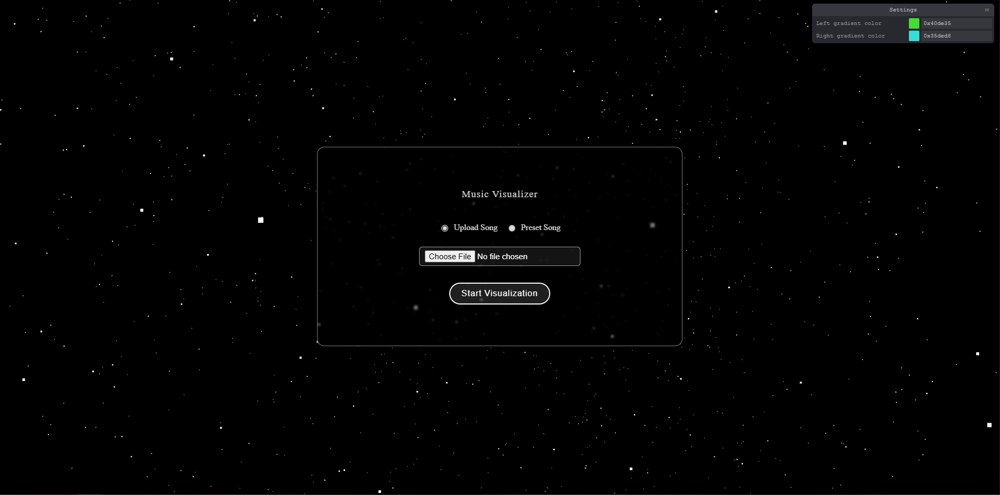
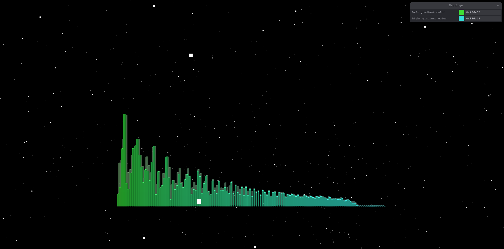

# Music-Visualizer

Music Visualizer is a website where users can visualize how the frequencies in 
an audio track evolve as the audio plays. Users may select from a few preset songs
or upload their own audio file.

## Installation

1. Clone the repository:
    ```bash
    git clone https://github.com/AndyPhuHuynh/Music-Visualizer 
    ```

2. Install dependencies and run the development server:
    ```bash
    npm install
    npm run dev
    ```

3. Open your browser and navigate to `http://localhost:5173` (or whatever port Vite displays)

## Usage
First, either upload your own audio file or select one of the presets. Then click on `Start Visualization`


Wait as the audio gets analyzed and then sit back and watch the visualizer! The gradient
of the visualizer can be changed in real time using the panel in the top right corner.
